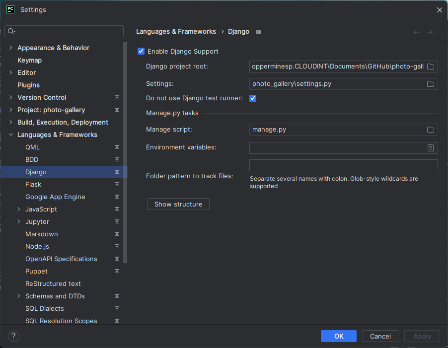
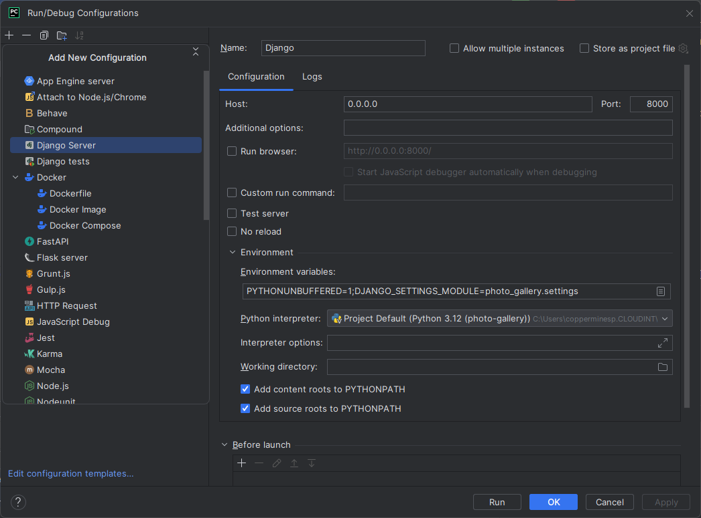
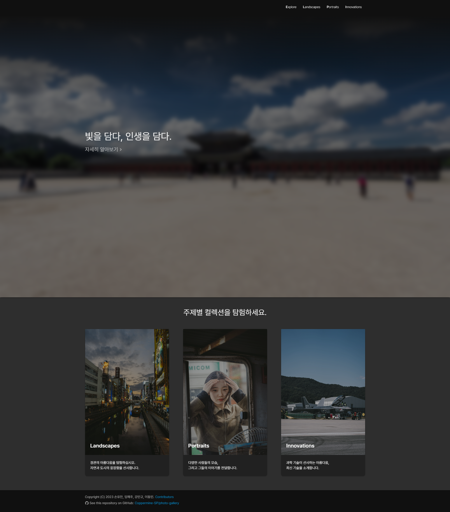
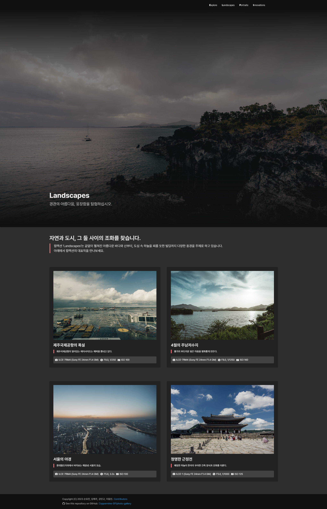
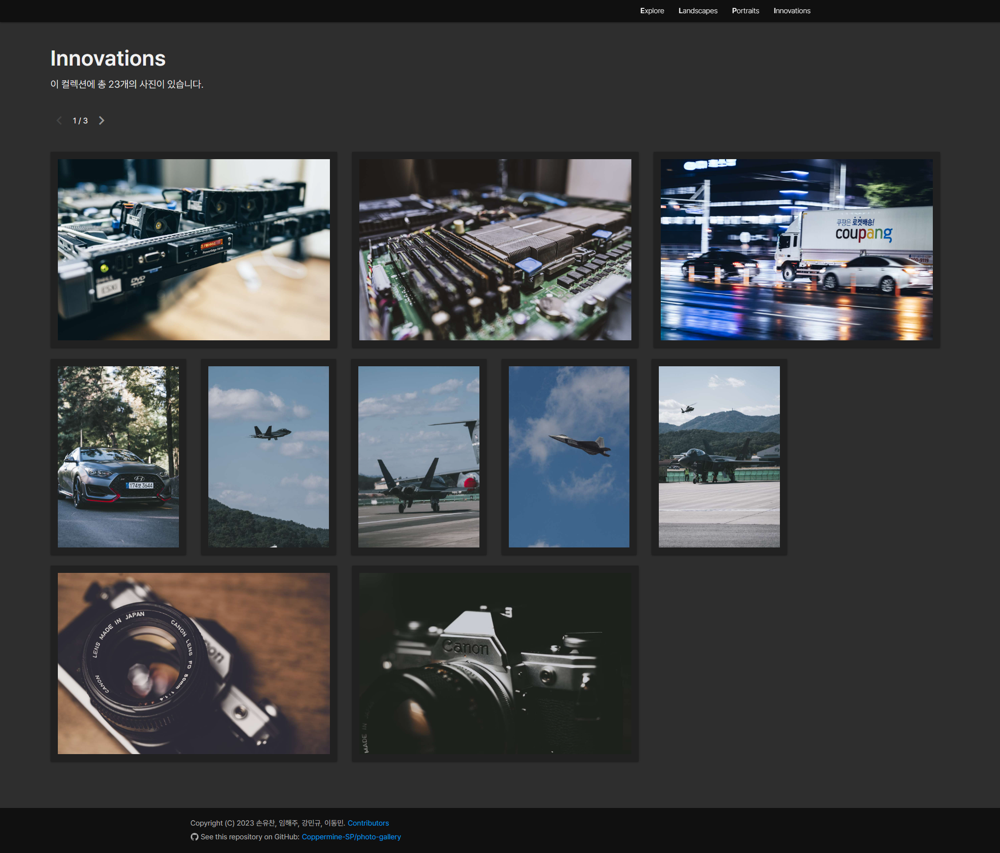
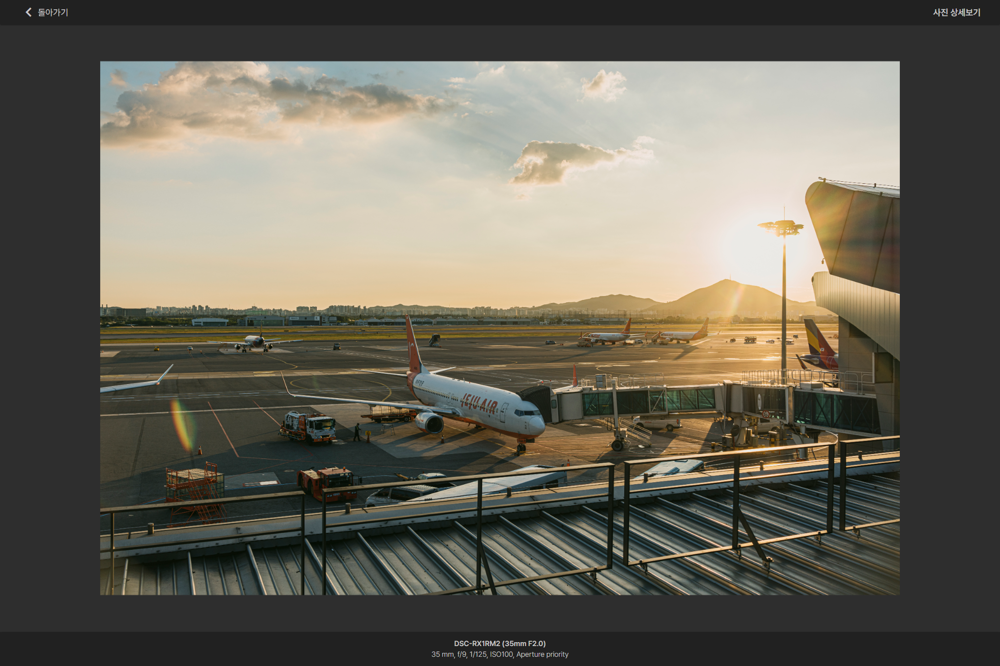
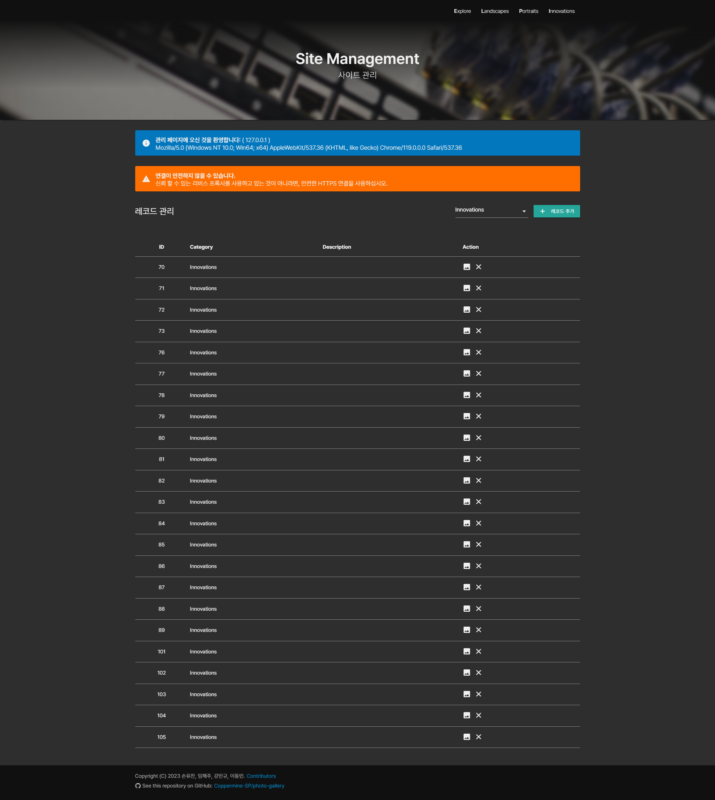
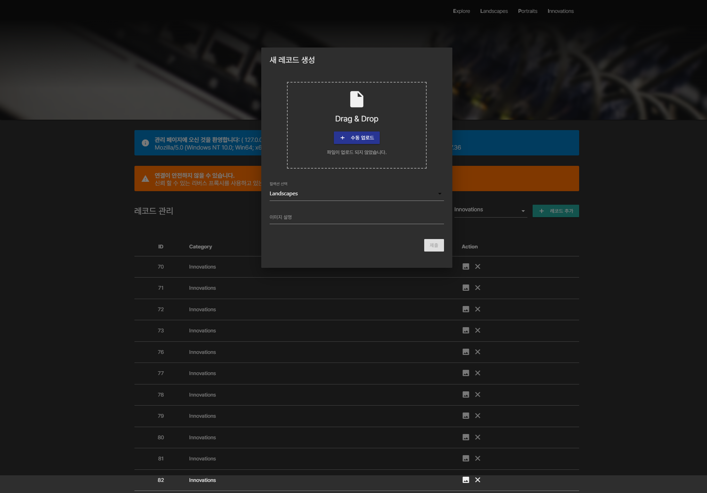
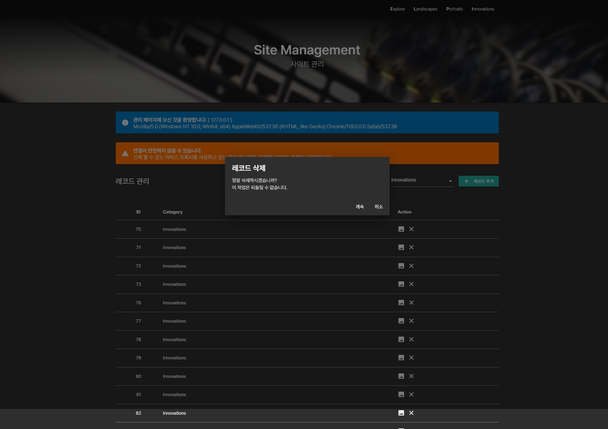
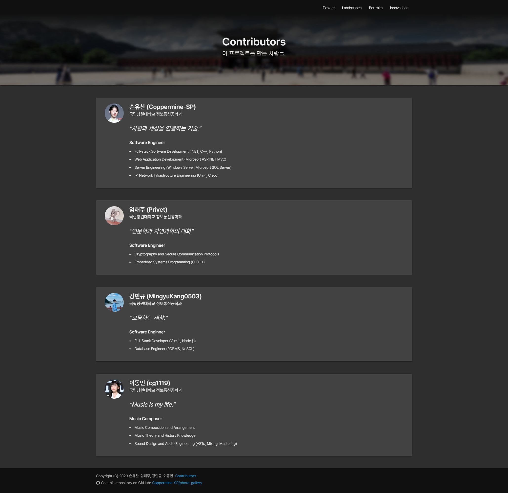

# photo-gallery
**2023년 창원대학교 정보통신공학과 웹프로그래밍 텀프로젝트**

이 프로젝트는 Django 기반의 간단한 사진 갤러리(포트폴리오) 웹 사이트입니다. 

### Table of Contents
- [How to Use](#how-to-use)
- [Dependencies](#dependencies)
- [Copyright Notice](#copyright-notice)
- [Showcase](#showcase)

## How to Use

### System Environment을 통한 실행

먼저 Django 패키지와 의존성를 설치해야 합니다.
```
pip install Django
pip install django-cleanup
pip install django-imagekit
```
그리고 프로젝트 루트 폴더의 photo_gallery로 이동하여 다음 커멘드를 실행하십시오:
```
python3 manage.py runserver
```

### Virtual Environment를 통한 실행 (Recommended)
Jetbrain Pycharm에서 이 프로젝트를 불러 온 후, 새 venv를 생성하고 Django 패키지를 설치하십시오.

하단의 Terminal에서 아래 명령어로 의존성 패키지를 설치하십시오:
```
pip install django-cleanup
pip install django-imagekit
```

이제 Pycharm Project에서 Django 지원을 활성화하고, Run Configuration을 생성해야 합니다.


Project Settings (Ctrl + Alt + S)에서 Language & Frameworks > Django 페이지에서 Django 지원을 활성화하십시오.



새 Django Server Configuration을 Run Configurations에 추가하고 실행합니다.


## Dependencies

### Front-end Dependencies
- **MaterializeCSS** - https://github.com/Dogfalo/materialize
- **ExifReader** - https://github.com/mattiasw/ExifReader#examples

### Back-end Dependencies
- **django-cleanup** - https://pypi.org/project/django-cleanup/
- **django-imagekit** -https://pypi.org/project/django-imagekit/

## Copyright Notice
**이 프로젝트에 사용된 모든 샘플 이미지는 저작권으로 보호되는 이미지입니다.**

이러한 이미지는 시연을 위하여 사용되었으며, 다음과 같은 권리 및 제한 사항이 적용됩니다:

- 이 프로젝트에 포함된 샘플 이미지는 Coppermine-SP에게 저작권이 있으며, 저작권법에 의해 보호됩니다. 이러한 이미지의 무단 복제, 배포, 전송, 전재 및 기타 형태로 이 프로젝트 외부에서 사용하는 것을 엄격하게 금지합니다.
  
- 사진에 등장하는 모든 인물에 대한 초상권은 촬영 당시 본인의 명시적인 허락을 받아 취득되었습니다.
  

## Showcase

### 메인 페이지 (Index)


### 컬렉션 소개 페이지


### 리스트 페이지


### 사진 상세보기 페이지


### 관리 페이지


### 레코드 추가 모달


### 레코드 삭제 모달


### 제작자 소개 페이지

